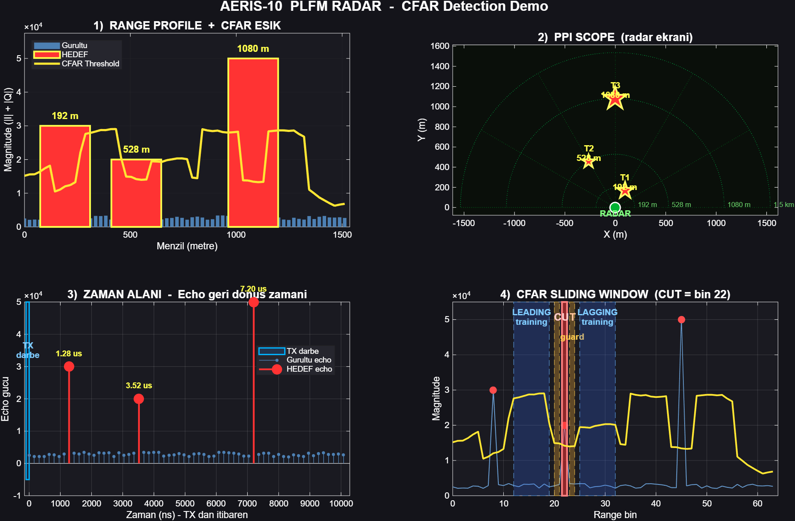

# AERIS-10 PLFM Radar — CA-CFAR MATLAB Demo

[](https://www.mathworks.com/products/matlab.html)
[](LICENSE)
[]()

MATLAB visualization of **Cell-Averaging CFAR (CA-CFAR)** for the open-source [AERIS-10 PLFM phased-array radar](https://github.com/NawfalMotii79/PLFM_RADAR). The scenario matches the Verilog testbench (`iverilog_demo/radar_demo_tb.v`) and FPGA module `cfar_ca.v` — same noise seed, guard/train cells, and alpha threshold.

## Demo outputs

| Figure | Description |
|--------|-------------|
|  | Range profile, PPI scope, time-domain echo, CFAR sliding-window diagram |
|  | Full-size Plan Position Indicator with detected targets |

**Detected targets (3):**

| Range bin | Range | Magnitude | CFAR threshold | Margin |
|-----------|-------|-----------|----------------|--------|
| 8 | 192 m | 30,000 | 12,051 | +149% |
| 22 | 528 m | 20,000 | 14,180 | +41% |
| 45 | 1,080 m | 50,000 | 13,426 | +272% |

See [`output/cfar_results.txt`](output/cfar_results.txt) for the machine-readable summary.

## Radar parameters

- Carrier: **10.5 GHz** (X-band)
- Baseband sample rate: **100 MHz**
- Range bin size: **24 m** (16× decimation)
- Max range: **1536 m** (64 bins)
- CFAR: **G=2, T=8, α=5/16** (Q4.4 fixed-point, same as FPGA)

## Quick start

### MATLAB GUI

```matlab
cd matlab
radar_cfar_demo
```

### Windows batch (headless)

```bat
run_demo.bat
```

### Command line

```bat
"C:\Program Files\MATLAB\R2025b\bin\matlab.exe" -batch "cd('matlab'); radar_cfar_demo; exit"
```

**Requirements:** MATLAB R2019b or newer. No toolboxes required.

## Files

```
matlab/
  radar_cfar_demo.m   % main script
  run_demo.bat        % one-click Windows runner
output/
  cfar_demo.png       % 4-panel figure
  cfar_ppi.png        % PPI scope
  cfar_results.txt    % detection table
```

## FPGA / Verilog cross-reference

| MATLAB | Verilog / FPGA |
|--------|----------------|
| CA-CFAR loop | `9_Firmware/9_2_FPGA/cfar_ca.v` |
| Noise + 3 targets | `iverilog_demo/radar_demo_tb.v` |
| Range decimation | `range_bin_decimator.v` |

Re-run the Icarus Verilog demo to compare bit-exact detection flags:

```bat
cd iverilog_demo
iverilog -o sim radar_demo_tb.v cfar_ca.v range_bin_decimator.v
vvp sim
```

## Related projects

- [PLFM_RADAR](https://github.com/NawfalMotii79/PLFM_RADAR) — full AERIS-10 hardware & firmware
- [matlab-fmcw-isac-examples](https://github.com/Alp2246/matlab-fmcw-isac-examples) — FMCW / ISAC MATLAB demos

## License

MIT — see [LICENSE](LICENSE). AERIS-10 hardware is under [CERN-OHL-P](https://ohwr.org/cern_ohl_p_v2.txt) in the upstream PLFM_RADAR repository.

## Citation

If you use this demo in coursework or research, please link to this repo and credit the AERIS-10 / PLFM_RADAR project.
