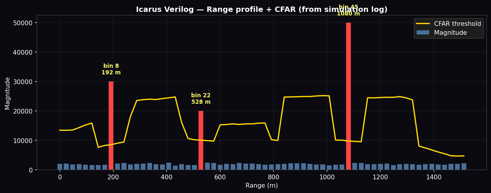

# AERIS-10 Radar CFAR — Verilog Testbench & Verification Demo

**Author:** [Alperen Bugra Ozer](https://github.com/Alp2246)  
**Verilog testbench + Icarus simulation harness + MATLAB cross-check**

[](hdl/radar_demo_tb.v)
[](matlab/radar_cfar_demo.m)
[](LICENSE)
[](output/iverilog_cfar_detections.txt)

> Portfolio example: a **self-checking Verilog testbench** that drives real AERIS-10 CFAR FPGA IP, detects 3 synthetic radar targets, and prints PASS/FAIL — runnable with free tools (no Vivado sim).



---

## What I built

| Component | Path | Description |
|-----------|------|-------------|
| **Verilog testbench** | [`hdl/radar_demo_tb.v`](hdl/radar_demo_tb.v) | Stimulus, DUT hookup, detection capture, ASCII range plot, auto PASS/FAIL |
| Simulation runner | [`iverilog_demo/demo.ps1`](iverilog_demo/demo.ps1) | One-click compile + coloured console demo |
| MATLAB twin | [`matlab/radar_cfar_demo.m`](matlab/radar_cfar_demo.m) | Same scenario — figures for reports |
| Walkthrough | [`docs/VERILOG_WALKTHROUGH.md`](docs/VERILOG_WALKTHROUGH.md) | Architecture + annotated code |

**DUT (upstream IP):** [`third_party/cfar_ca.v`](third_party/cfar_ca.v) — CA-CFAR block from [AERIS-10 PLFM_RADAR](https://github.com/NawfalMotii79/PLFM_RADAR) (CERN-OHL-P). License details: [NOTICE.md](NOTICE.md).

---

## Verilog highlight — DUT + checker

```verilog
// hdl/radar_demo_tb.v — @Alp2246
cfar_ca #(.NUM_RANGE_BINS(64), .NUM_DOPPLER_BINS(32)) dut ( ... );

always @(posedge clk)
    if (det_valid && cfar_busy && det_doppler == 5'd0 && det_flag)
        $display("*** DETECTION *** bin=%0d range=%0d m", det_range, det_range * 24);

// ...
if (n_det_0 == 3)
    $display(">>>> [PASS]  All targets found, zero false alarms.");
```

Full walkthrough: [**docs/VERILOG_WALKTHROUGH.md**](docs/VERILOG_WALKTHROUGH.md)

---

## Results (committed)

| | Verilog | MATLAB |
|---|---------|--------|
| Targets found | 3/3 @ bins 8, 22, 45 | 3/3 — same bins |
| False alarms | 0 | 0 |
| Verdict | **PASS** | match |

| Artifact | Link |
|----------|------|
| Range profile (plot) | [output/iverilog_range_profile.png](output/iverilog_range_profile.png) |
| 4-panel figures | [output/cfar_demo.png](output/cfar_demo.png) |
| Sim log | [output/iverilog_cfar_demo_log.txt](output/iverilog_cfar_demo_log.txt) |
| Cross-check | [output/matlab_vs_verilog_comparison.txt](output/matlab_vs_verilog_comparison.txt) |

---

## Run it

```powershell
git clone https://github.com/Alp2246/aeris10-plfm-cfar-demo.git
cd aeris10-plfm-cfar-demo\iverilog_demo
.\demo.ps1 -NoWave
```

```bash
iverilog -g2012 -DSIMULATION -o sim.vvp -s radar_demo_tb \
  hdl/radar_demo_tb.v third_party/cfar_ca.v
vvp sim.vvp
```

```matlab
cd matlab; radar_cfar_demo
```

Regenerate all outputs: `.\scripts\export_outputs.ps1`

---

## Repo layout

```
hdl/                    ← my Verilog (start here for code review)
  radar_demo_tb.v
  hello_tb.v
third_party/            ← AERIS-10 CFAR IP (DUT)
iverilog_demo/          ← demo.ps1, GTKWave config
matlab/                 ← MATLAB figures
output/                 ← committed run artifacts
docs/VERILOG_WALKTHROUGH.md
LICENSE                  MIT — original work
NOTICE.md                Full license split (MIT vs CERN-OHL-P)
CREDITS.md               Author + citation examples
CITATION.cff             Machine-readable metadata
```

---

## Scenario

- **Radar:** 10.5 GHz X-band, 100 MHz baseband, 24 m/bin, 1536 m max range  
- **CFAR:** CA-CFAR, guard=2, train=8, α=5/16  
- **Targets:** 192 m / 528 m / 1080 m — seed `0xA5A51234`

---

## License & credits

This repo uses **two licenses** — original demo work vs upstream FPGA IP.

| Component | Author | License | Details |
|-----------|--------|---------|---------|
| `hdl/`, `matlab/`, `scripts/`, `output/`, docs | [Alperen Bugra Ozer](https://github.com/Alp2246) | **MIT** | [LICENSE](LICENSE) |
| `third_party/cfar_ca.v` (DUT) | [AERIS-10 / PLFM_RADAR](https://github.com/NawfalMotii79/PLFM_RADAR) | **CERN-OHL-P** | [third_party/](third_party/) |

**Full breakdown** (file-by-file, output artifacts, tool licenses, attribution text):

- [NOTICE.md](NOTICE.md) — complete license notice  
- [CREDITS.md](CREDITS.md) — author + thesis citation examples  
- [CITATION.cff](CITATION.cff) — machine-readable cite metadata  

[](LICENSE)
[](https://ohwr.org/cern_ohl_p_v2.txt)
