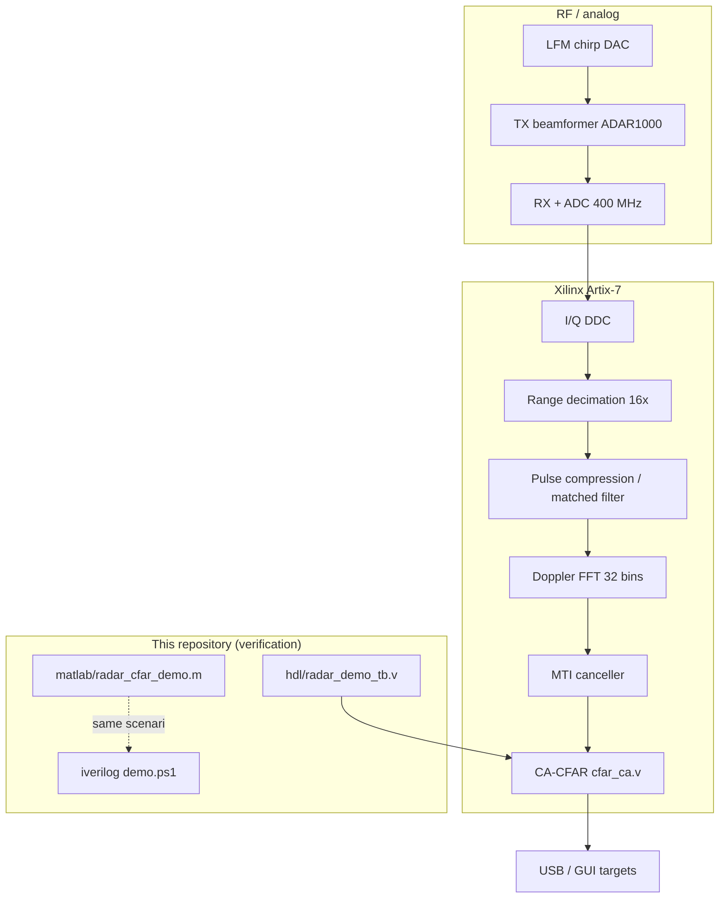

# AERIS-10 PLFM Radar — System context & where this demo fits

**Author:** [Alperen Bugra Ozer](https://github.com/Alp2246)  
**Purpose:** Show how the CFAR verification demo connects to the full open-source AERIS-10 radar platform.

---

## Platform overview

[AERIS-10](https://github.com/NawfalMotii79/PLFM_RADAR) is an open **10.5 GHz Pulse-LFM phased-array** radar:

| Variant | Range | Antenna |
|---------|-------|---------|
| AERIS-10N (Nexus) | ~3 km | 8×16 patch array |
| AERIS-10E (Extended) | ~20 km | 32×16 slotted waveguide |

Upstream reference images (CERN-OHL-P — **not stored in this repo**):

- [System photo](https://raw.githubusercontent.com/NawfalMotii79/PLFM_RADAR/main/8_Utils/3fb1dabf-2c6d-4b5d-b471-48bc461ce914.jpg)
- [Antenna array](https://raw.githubusercontent.com/NawfalMotii79/PLFM_RADAR/main/8_Utils/Antenna_Array.jpg)
- [Block diagram](https://raw.githubusercontent.com/NawfalMotii79/PLFM_RADAR/main/8_Utils/RADAR_V6_V2.png)
- [Python GUI](https://raw.githubusercontent.com/NawfalMotii79/PLFM_RADAR/main/8_Utils/GUI_V6.gif)

---

## FPGA signal-processing chain



---

## What this repo verifies

| Layer | Artifact | Result |
|-------|----------|--------|
| **Verilog TB** | `hdl/radar_demo_tb.v` | Drives `cfar_ca.v`, 3/3 PASS |
| **Icarus sim** | `output/iverilog_cfar_demo_log.txt` | Live detection log |
| **11-module pack** | `output/iverilog_module_tests_summary.txt` | 11 PASS (with full PLFM checkout) |
| **MATLAB twin** | `output/matlab/cfar/` | 5 panels + PPI |
| **Cross-check** | `output/matlab_vs_verilog_comparison.txt` | Same detection bins |

### Demo radar parameters (AERIS-10N class)

| Parameter | Value |
|-----------|-------|
| Carrier \(f_c\) | 10.5 GHz |
| Baseband \(f_s\) | 100 MHz |
| Range bin (after 16× decim.) | 24 m |
| Range bins | 64 → 1536 m max |
| Doppler bins | 32 |
| CFAR | CA-CFAR, G=2, T=8, α=5/16 (Q4.4) |
| Ground truth | bins 8 / 22 / 45 @ 192 / 528 / 1080 m |

---

## Committed output map (full picture)

```
output/
├── matlab/cfar/          ← CFAR figures (this radar demo)
├── matlab/gallery/       ← FMCW, wireless, GNSS MATLAB portfolios
├── iverilog/             ← 5 PNGs from VCD + sim log
├── iverilog_*.txt/png    ← Verilog logs (legacy root plot)
├── cfar_demo.png         ← legacy CFAR composite
└── matlab_vs_verilog_comparison.txt
```

Index: [OUTPUT_CATALOG.md](OUTPUT_CATALOG.md)

---

## Related MATLAB portfolios (same author)

| Topic | Repo | Figures in gallery |
|-------|------|------------------|
| FMCW / ISAC | [matlab-fmcw-isac-examples](https://github.com/Alp2246/matlab-fmcw-isac-examples) | RD, MIMO, Kalman, OFDM |
| Wireless PHY | [matlab-wireless-comm-examples](https://github.com/Alp2246/matlab-wireless-comm-examples) | BPSK BER |
| GNSS security | [gnss-spoofing-research](https://github.com/Alp2246/gnss-spoofing-research) | PRN bias, ramp, residual, metrics |

---

## Licence pointer

| Content | Licence |
|---------|---------|
| Testbench, scripts, MATLAB, `output/` (except gallery fetch) | MIT — [LICENSE](../LICENSE) |
| `third_party/cfar_ca.v` | CERN-OHL-P — [CERN-OHL-P-NOTICE.txt](../third_party/CERN-OHL-P-NOTICE.txt) |
| Full AERIS-10 hardware | CERN-OHL-P upstream |
| Gallery PNGs | MIT per sibling repo |

Details: [LEGAL.md](LEGAL.md) · [NOTICE.md](../NOTICE.md)
