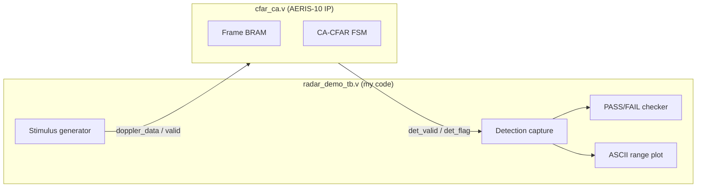

# Verilog walkthrough

**Author:** [Alperen Bugra Ozer](https://github.com/Alp2246)  
**Project:** Radar CA-CFAR verification harness for AERIS-10 PLFM

---

## What this demonstrates

A self-checking **Verilog testbench** that:

1. Models a 64-bin × 32-Doppler radar frame
2. Injects three known targets into Gaussian-like noise (fixed LFSR seed)
3. Drives the real `cfar_ca` FPGA module as DUT
4. Logs each detection with range, magnitude, threshold, and margin
5. Renders an ASCII range profile for terminal / coursework reports
6. Asserts **PASS** when exactly 3 targets are found

No Xilinx/Vivado simulator required — runs on **Icarus Verilog**.

---

## Architecture



---

## Key code — DUT instantiation

The testbench wires the CFAR block exactly as in the FPGA top-level:

```verilog
cfar_ca #(
    .NUM_RANGE_BINS  (64),
    .NUM_DOPPLER_BINS(32)
) dut (
    .clk                 (clk),
    .reset_n             (reset_n),
    .doppler_data        (dop_data),
    .doppler_valid       (dop_valid),
    .doppler_bin_in      (dop_bin),
    .range_bin_in        (rng_bin),
    .frame_complete      (frame_done),
    .cfg_guard_cells     (cfg_guard),      // G = 2
    .cfg_train_cells     (cfg_train),      // T = 8
    .cfg_alpha           (cfg_alpha),      // 5/16 Q4.4
    ...
);
```

Full source: [`hdl/radar_demo_tb.v`](../hdl/radar_demo_tb.v)

---

## Key code — live detection monitor

```verilog
always @(posedge clk) begin
    if (det_valid && cfar_busy && det_doppler == 5'd0) begin
        cap_mag[det_range] <= det_mag;
        cap_thr[det_range] <= det_thr;
        cap_det[det_range] <= det_flag;
        if (det_flag) begin
            n_det_0 <= n_det_0 + 1;
            $display(" *** DETECTION *** bin=%0d range=%0d m mag=%0d thr=%0d",
                     det_range, det_range * 24, det_mag, det_thr);
        end
    end
end
```

---

## Key code — automated verdict

```verilog
if (n_det_0 == 3)
    $display(" >>>> [PASS]  All targets found, zero false alarms.");
else if (n_det_0 > 3)
    $display(" >>>> [WARN]  Too many detections — raise alpha.");
else
    $display(" >>>> [WARN]  Missed target — lower alpha or raise SNR.");
```

---

## Simulation result

```
bin | range | magnitude | threshold | margin
  8 | 192 m |     30000 |      8536 |  251%
 22 | 528 m |     20000 |     10050 |   99%
 45 |1080 m |     50000 |      9803 |  410%

>>>> [PASS]  All targets found, zero false alarms.
```

See committed logs and plots in [`output/`](../output/).

---

## How to run

```powershell
cd iverilog_demo
.\demo.ps1 -NoWave
```

```bash
iverilog -g2012 -DSIMULATION -o sim.vvp -s radar_demo_tb \
  hdl/radar_demo_tb.v third_party/cfar_ca.v && vvp sim.vvp
```

---

## Also in this repo

| Component | Folder | Author |
|-----------|--------|--------|
| Verilog testbench | `hdl/` | @Alp2246 |
| Simulation runner | `iverilog_demo/demo.ps1` | @Alp2246 |
| MATLAB twin demo | `matlab/` | @Alp2246 |
| CFAR RTL (DUT) | `third_party/cfar_ca.v` | AERIS-10 team |
